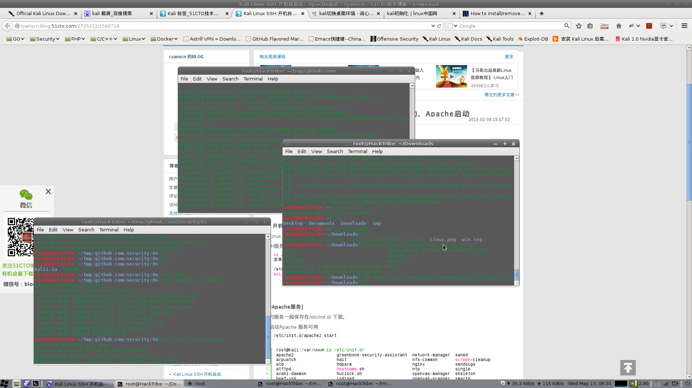
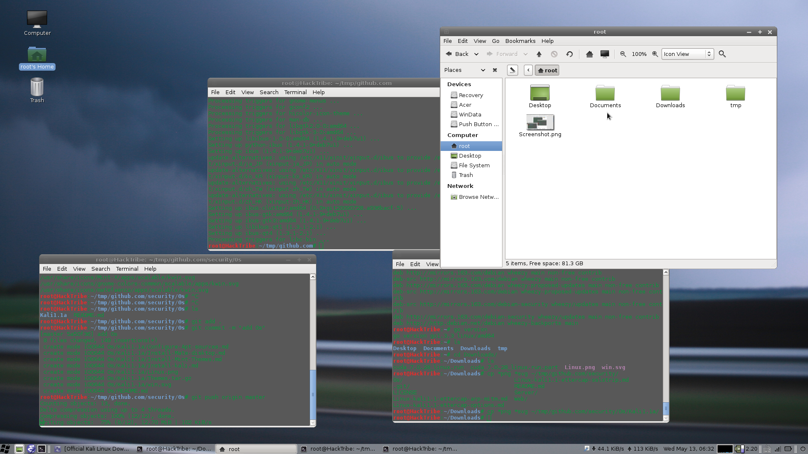

## 安装mint的主题

这个[主题](Themes.tar.gz)是我从mint 17.1直接copy出来的。

安装的操作
```
tar zxvf Themes.tar.gz
cd Themes
tar zxvf mint-themes.tar.gz
cd mint-themes
cp -rfv ./* /usr/share/themes/
cd ..
tar zxvf icons.tar.gz
cd icons
cp -rfv ./* /usr/share/icons/

```
然后就可以通过主题管理器选择mint系列的主题了

start menu太丑了，所以在网上找了个win的svg图。
Linux的没找到，找到了个png的，可以用工具转换svg

```
cp -rfv win.svg /usr/share/icons/Mint-X/places/24/start-here.svg
```
最后的效果图：



