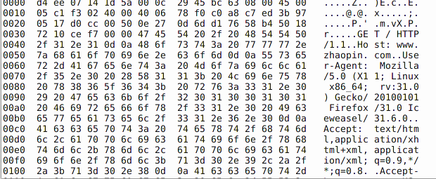
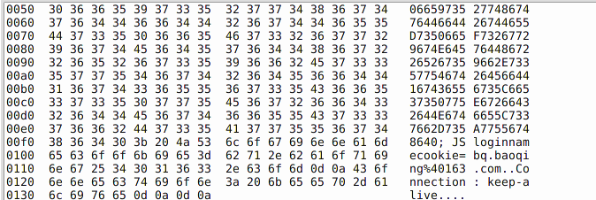

## 不安全通信
HTTP 数据包可以被WireShark 等工具捕获，直接明文读取。
使用 HTTPS 访问后，所有数据被加密。服务器与应用程序通过传输层安全（Transport
Layer Security （TLS））又称为安全套接字层（Secure Socket Layer (SSL)）。TLS 是一
种混合的加密协议，一个主密钥来建立通信。这个密钥使用的是SHA-1 或MD5。

### 使用场景
HTTP协议，TCP/IP协议等。

### 漏洞分析
web服务都是运行在http协议上的。所以，密码是明文传输的，如果在局域网中有恶意用户拦截，arp欺骗等手段，是很容易窃取到用户的登录信息等。
例如使用WireShark等抓包工具进行抓取到的数据：



```
HTTP/1.1 200 OK
Cache-Control: private
Content-Type: text/plain; charset=utf-8
Content-Encoding: gzip
Vary: Accept-Encoding
Server: Microsoft-IIS/7.5
Set-Cookie: sid=7p5Y57XPt8TiC/1bU/YdWB7L16ttcaTyCk5ONhRIO89D8UrjC0tHr5ME1u280JxuXAuDwtZEW89W8tEio2nRIPTZhGI8X67UXWjTHBsthFzIisPXoWztU0hYItLkYLlnE6VXnjS/pBhWjhKKHhKv+KSAQGQ=; expires=Thu, 01-May-2025 05:10:29 GMT; path=/
Access-Control-Allow-Origin: http://converter.telerik.com
Date: Mon, 04 May 2015 05:10:29 GMT
Content-Length: 590

```

### 危害
用户可以抓取网络传输中的明文密码等信息。

### 解决方案
web使用https协议。加密传输数据等方式。